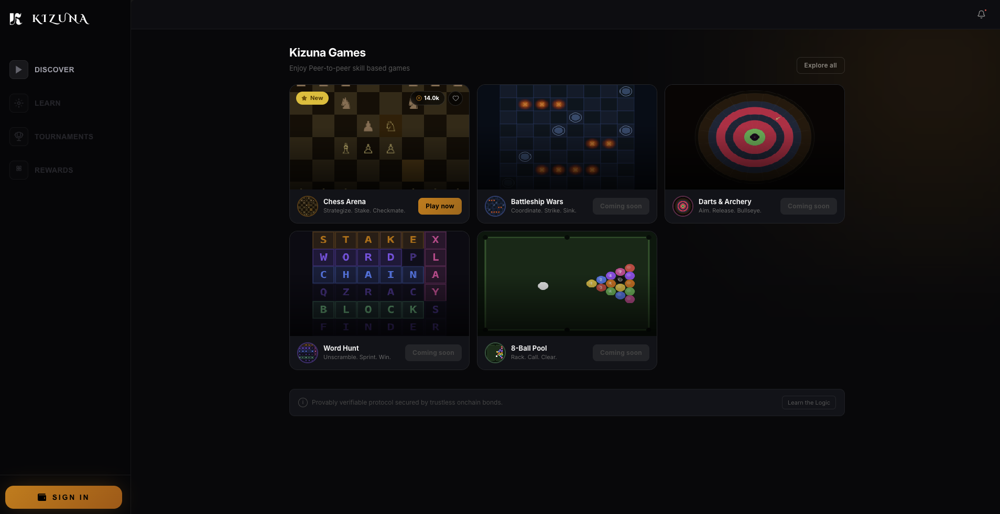
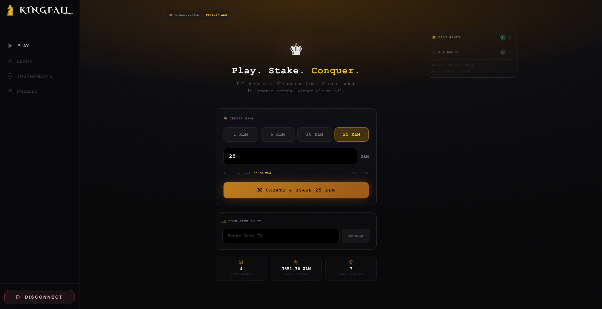
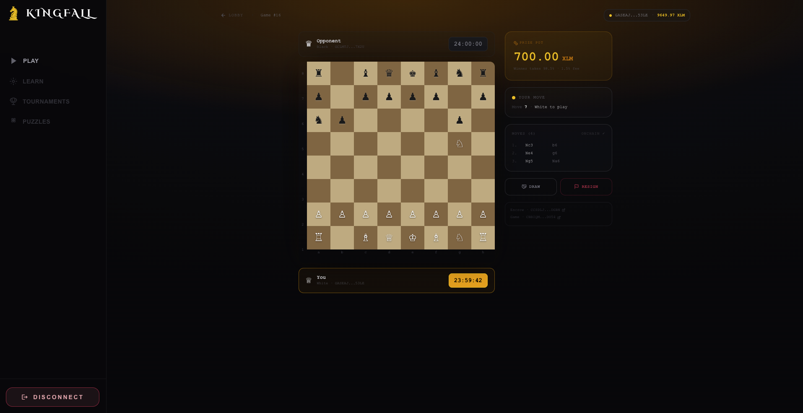
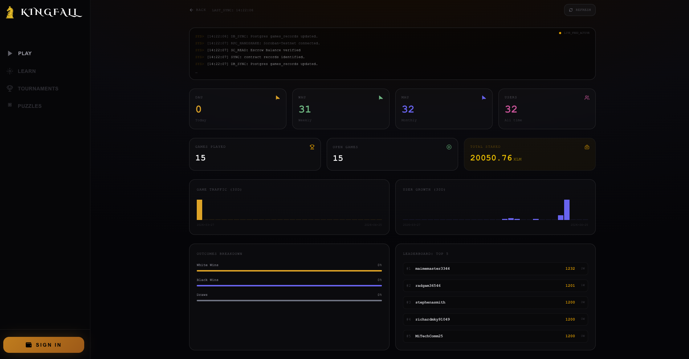
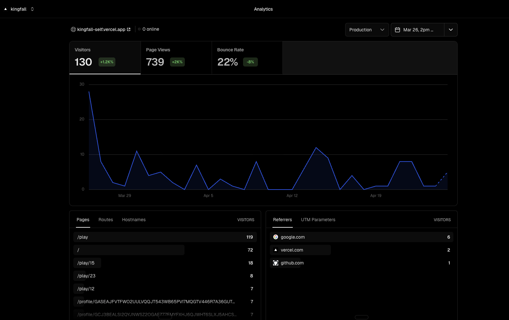
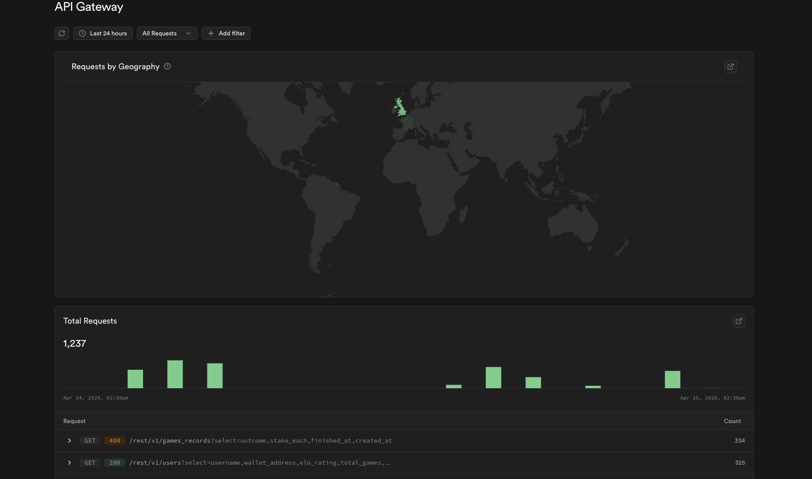

# ♚ Kizuna — P2P Skill-Stakes Arcade on Stellar

> Stake XLM. Prove your skill. Winner claims all. Trustless gaming secured by Soroban.

[](https://kizuna-self.vercel.app)
[](https://youtu.be/hs7aOUaPQqw?si=CwC-NiZL54xVmsc8)

---

## Live Demo

> **[https://kizuna-games.vercel.app](https://kizuna-games.vercel.app)**

## Demo Video

> **[Watch full MVP walkthrough →](https://youtu.be/hs7aOUaPQqw?si=CwC-NiZL54xVmsc8)**

The video covers: creating a game, staking XLM, joining as black, making moves (committed onchain), check detection, checkmate, and winner payout via escrow.

---

## What is Kizuna?

Kizuna (絆 - "Bond") is an arcade hub for independent, skill-based platforms built on Stellar. Unlike traditional gaming sites, Kizuna uses Soroban smart contracts to act as a trustless escrow. Players stake digital assets (XLM) into a secure "bond" before a match. The protocol ensures that the pot is only released to the winner based on immutable onchain move records.

Current Supported:

Chess: Full move-validation and FEN-syncing onchain.

Pool (Coming Soon): Physics-based wagering.

Battleship (Coming Soon): Zero-knowledge stake protection.
---

## Screenshots

| Home | Lobby | Game |
|---|---|---|
|  |  |  |

---

## Architecture

> 📐 **[Full Architecture Document → ARCHITECTURE.md](./Architecture.md)**
> Covers contract state machines, data flow diagrams, Rust structs, chess engine design, and key implementation patterns.

```
.
├── contracts/
│   ├── kizuna-escrow/    # Global stake management & multi-game payouts
│   ├── kizuna-chess/     # Chess-specific: Move history, FEN state, validation
│   └── kizuna-payout/    # Fee treasury & season prize distribution
└── app/                  # Next.js 14 Hub
├── play/             # The Game Lobby — discover and join active bonds
├── chess/            # Dedicated Chess platform logic
├── metrics/          # Network-wide analytics (DAU, Total Staked)
└── api/
└── fee-bump/     # Protocol-level fee sponsorship (Gasless play)
```

### Protocol Flow

```
1.  **The Bond:** Player A creates a game in `kizuna-escrow`. XLM is locked.

2.  **The Connection:** Player B joins. The bond is activated.

3.  **The Proof:** Every significant action (e.g., a Chess move) is committed to the specific game contract as an immutable record.

4.  **The Settlement:** Upon victory, the winner triggers `finish_game`. The escrow contract verifies the game status and releases **98.5%** of the pot to the winner (**1.5%** protocol fee).

```

### Key Design Patterns

* **Escrow-First Security:** XLM never leaves the smart contract until a winner is determined by the game logic.

* **Gasless Transactions:** Kizuna implements **Fee Sponsorship**. Users sign the transaction logic, but the Kizuna protocol account pays the network fees.

* **Pure Black/White UI:** A high-end, reflective arcade aesthetic designed for immersive competition.

* **Universal Metrics:** A unified dashboard tracking Daily Active Users (DAU) and total network volume across all Kizuna titles.
---

## Contract Addresses (Testnet)

| Contract | Address |
|---|---|
| Escrow | `CCSDLJLDIJSAOKFLX2QWCOVLENA4FFN2EMSGJRFKTIBYY4UUA2HKDGBN` |
| Game | `CBBIQM6V5XEF5PBB7DARQ2Q26WHBHKLPYKD4ELHOQ7YBZ4CMJXC2DO54` |
| Payout | `CB233DDZB35CHH5ERR7FWPVRFDKKKFZQI54E3I7VAVFOEBIEPBRJX3I6` |
| Native XLM SAC | `CDLZFC3SYJYDZT7K67VZ75HPJVIEUVNIXF47ZG2FB2RMQQVU2HHGCYSC` |

---

## Contract Functions

### Escrow (`kizuna-escrow`)

| Function | Description |
|---|---|
| `create_game(white, token, stake, deadline)` | Lock white's stake, create game record, return game ID |
| `join_game(id, black)` | Lock black's matching stake, flip status to Active |
| `finish_game(id, caller, outcome, moves)` | Pay out winner or split on draw, set status Finished/Drawn |
| `offer_draw(id, caller)` | Record draw offer |
| `accept_draw(id, caller)` | Accept draw, trigger split payout |
| `cancel_game(id, caller)` | Cancel waiting game, return stake |
| `get_game(id)` | Fetch full GameData struct |
| `get_active_games()` | Vec of waiting game IDs |
| `get_player_games(player)` | Vec of game IDs for a player |

### Game (`kizuna-game`)

| Function | Description |
|---|---|
| `create_game(white, black, escrow_id, timeout)` | Initialize game record, store starting FEN |
| `commit_move(id, player, san, fen_after)` | Append MoveRecord with SAN + FEN |
| `complete_game(id, caller, outcome, pgn)` | Mark game settled, store PGN hash |
| `get_game(id)` | Full game state including moves array |
| `get_all_games()` | Vec of all game IDs |
| `get_current_fen(id)` | Current board FEN string |

---

## Chess Rules Implemented

- Full legal move generation with check filtering
- Checkmate detection → automatic `finish_game`
- Stalemate detection → automatic draw
- Castling (kingside + queenside)
- En passant capture
- Pawn promotion (auto-queens)

---

## Metrics Dashboard

> **[Live Metrics → kizuna-self.vercel.app/metrics](https://kizuna-self.vercel.app/metrics)**

The `/metrics` page fetches live data directly from Supabase DB and displays:

- **DAU (Daily Active Users)** — users active in last 24h, 7d, 30d
- **Total Transactions** — all `commit_move` + `finish_game` calls tracked via `game_records`
- **Retention** — % of users who returned after their first game
- **Games played** — total completed games, win/draw/loss breakdown
- **Top players** — ELO leaderboard with XLM won
- **Total Staked** — total XLM staked across all games



---

## Monitoring

kizuna uses three monitoring layers:

**1. Vercel Analytics (Frontend)**
- Page views, unique visitors, Web Vitals (LCP, FID, CLS)
- Geographic distribution of users
- Error tracking via Vercel logs



**2. Supabase Dashboard (Backend)**
- Edge Function invocation counts and error rates
- Database query performance
- Storage usage



**3. Stellar Expert (Onchain)**
- Contract transaction history: [Escrow](https://stellar.expert/explorer/testnet/contract/CCSDLJLDIJSAOKFLX2QWCOVLENA4FFN2EMSGJRFKTIBYY4UUA2HKDGBN)
- Real-time fee and transaction monitoring

---

## Security Checklist

| # | Check | Status |
|---|---|---|
| 1 | Smart contract auth — all state-changing functions require `caller.require_auth()` | ✅ |
| 2 | Stake validation — `join_game` verifies exact stake match before locking | ✅ |
| 3 | Player-only actions — `commit_move` and `finish_game` reject non-participants | ✅ |
| 4 | Resign guard — resigning player cannot declare themselves the winner | ✅ |
| 5 | Duplicate game prevention — `game_records` table deduplicated by `escrow_game_id` | ✅ |
| 6 | Sponsor key isolation — `SPONSOR_SECRET_KEY` is server-only, never in client bundle | ✅ |
| 7 | Fee bump rate limiting — `/api/fee-bump` limits 10 sponsored txs per address per hour | ✅ |
| 8 | Input validation — all Supabase edge functions validate wallet address format | ✅ |
| 9 | No admin key on escrow — payout logic is fully autonomous, no privileged withdrawal function | ✅ |
| 10 | XSS protection — Next.js built-in sanitization, no dangerouslySetInnerHTML | ✅ |
| 11 | Environment variables — all secrets in Vercel env, not committed to repo | ✅ |
| 12 | Open source contracts — all three Soroban contracts publicly auditable on GitHub | ✅ |

---

## Advanced Feature — Fee Sponsorship (Gasless Transactions)

kizuna implements **fee bump transactions** so users pay zero XLM in transaction fees. Every game action — create, join, commit move, finish — is sponsored by the kizuna protocol account.

**How it works:**

1. User's wallet signs the inner Soroban transaction (with fee: 100 stroops minimum)
2. Signed XDR is sent to `/api/fee-bump` (server-side Next.js route)
3. Server wraps it in a `FeeBumpTransaction` signed by the sponsor keypair
4. Fee bump tx is submitted — sponsor account pays the actual network fee
5. User's wallet balance is unchanged by fees

**Implementation:**
- Route: `app/api/fee-bump/route.ts`
- Sponsor account: funded separately, monitored for balance
- Rate limit: 10 sponsored transactions per wallet address per hour
- Fallback: if sponsor balance < 1 XLM, endpoint returns 503 and client submits directly

```typescript
// Server builds and signs the fee bump
const feeBumpTx = TransactionBuilder.buildFeeBumpTransaction(
  sponsorKeypair,   // sponsor pays
  MAX_FEE,          // max 100,000 stroops per tx
  innerTx,          // user's signed inner tx
  networkPassphrase
);
feeBumpTx.sign(sponsorKeypair);
```

**Proof of implementation:** `app/api/fee-bump/route.ts` in the GitHub repository.

---

## Data Indexing

kizuna uses **Supabase as a real-time data index** over Stellar onchain events.

**Indexed tables:**

| Table | What it indexes | Updated by |
|---|---|---|
| `users` | ELO, financials, streaks per wallet | `game-result` edge function after every `finish_game` |
| `game_records` | Full game history — outcome, moves, payout, tx hash | `game-result` edge function |
| `achievements` | Unlocked badges per wallet | `game-result` edge function |

**How it works:**
- After `finish_game` confirms onchain, the frontend calls `/functions/v1/game-result`
- Edge function updates both player profiles atomically (ELO, P&L, streak)
- Inserts a `game_records` row with the escrow game ID, tx hash, outcome, stake, payout

**Query endpoint:**
```
POST https://[PROJECT].supabase.co/functions/v1/leaderboard
Body: { "sort_by": "elo_rating", "limit": 50 }
```

**Metrics endpoint:**
```
GET https://kizuna-self.vercel.app/metrics
```

---

## Community Contribution

> **[post on X/Twitter →](https://x.com/youthisman/status/2048045759912698034)**

Posted to the Stellar Developer Discord `#build` channel and Twitter/X announcing the MVP launch, demo video, and inviting testnet users.

---

## User Onboarding & Feedback

> **[Fill out the kizuna onboarding form →](https://docs.google.com/forms/d/1LNcoKAhoo5aT2hC0wLs3Qs5Cf32ZVGxVWkFpxehRAPk/viewform)**

New users: submit your wallet address, email, and product feedback via the form above.

> **[View responses →](https://docs.google.com/spreadsheets/d/1icdeNfq_sjCLNx_STQbscl3kQcK7SwvKMOPQ7W_qOng/edit?usp=sharing)**

All form responses including wallet addresses and product ratings are tracked in the sheet above.

---

## Improvements/User Feedback

### Shipped — Iteration 1
- **Castling support** — Implemented kingside and queenside castling per standard chess rules. [View commit →](https://github.com/youthisguy/kizuna/commit/fa3b278608eab3c97964a773b773c4194ce58874)
- **En passant capture** — en passant was rejected during testing. Implemented per standard rules. [View commit →](https://github.com/youthisguy/kizuna/commit/fa3b278608eab3c97964a773b773c4194ce58874)
- **Active games visible without game ID** — The lobby now auto-loads all user's games (created and joined) on mount. [View commit →](https://github.com/youthisguy/kizuna/commit/ede1b32af326a716aaabd8be2d5493591e1be67a)

### Planned — Iteration 2

Directly from user feedback:

- **In-game chat** — Live messaging with opponent during a game
- **Anti-cheat / dispute system** — Ability to flag or report suspected cheating

---

## Roadmap

Future Plans for kizuna:

- **ELO Ranking System** — Trustless onchain ELO engine (K=32) that automatically updates after every completed game. New players start at 1200.
- **Rich Onchain Player Profiles** — Dedicated profile page showing ELO rating, win/loss/draw statistics, win rate, current streak, total XLM won, and rating history.
- **Achievement Badges as NFTs**  - SEP-50 compliant NFTs automatically minted for milestones like "10 Win Streak" or "Tournament Champion."
- **Leaderboards** — Global and seasonal ELO leaderboards with top players eligible for prize pools from the protocol fee treasury.
- **Tournament Brackets:** Automated on-chain tournament hosting with multi-player prize pools.
- **Kizuna SDK:** Allowing third-party developers to plug their own game logic into the Kizuna Escrow protocol.
---

## Getting Started

### Prerequisites

- Rust + `wasm32-unknown-unknown` target
- Stellar CLI
- Node.js 18+
- [Freighter wallet](https://freighter.app) browser extension

```bash
rustup target add wasm32-unknown-unknown
cargo install --locked stellar-cli --features opt
```

### Build Contracts

```bash
cd contracts
cargo clean && cargo build --target wasm32-unknown-unknown --release
```

### Deploy to Testnet

```bash
stellar keys generate my-account --network testnet
stellar keys fund my-account --network testnet
export ADMIN=$(stellar keys address my-account)

# Deploy escrow
stellar contract deploy \
  --wasm target/wasm32-unknown-unknown/release/kizuna_escrow.wasm \
  --source my-account --network testnet
export ESCROW_ID=<printed_id>

# Deploy game
stellar contract deploy \
  --wasm target/wasm32-unknown-unknown/release/kizuna_game.wasm \
  --source my-account --network testnet
export GAME_ID=<printed_id>

# Deploy payout
stellar contract deploy \
  --wasm target/wasm32-unknown-unknown/release/kizuna_payout.wasm \
  --source my-account --network testnet
export PAYOUT_ID=<printed_id>

# Initialize
stellar contract invoke --id $PAYOUT_ID --source my-account --network testnet \
  -- initialize --admin $ADMIN --escrow_contract $ESCROW_ID --nft_contract $ESCROW_ID

stellar contract invoke --id $GAME_ID --source my-account --network testnet \
  -- initialize --escrow_contract $ESCROW_ID

stellar contract invoke --id $ESCROW_ID --source my-account --network testnet \
  -- set_payout_contract --caller $ADMIN --payout $PAYOUT_ID
```

### Run Frontend

```bash
cd app
npm install
npm run dev
```

Open [http://localhost:3000/play](http://localhost:3000/play)

---

## Testing the Full Flow

```bash
# 1. Create a game — stakes 5 XLM
stellar contract invoke --id $ESCROW_ID --source my-account --network testnet --send yes \
  -- create_game \
  --white $ADMIN \
  --token CDLZFC3SYJYDZT7K67VZ75HPJVIEUVNIXF47ZG2FB2RMQQVU2HHGCYSC \
  --stake 50000000 \
  --join_deadline 0

# 2. Join as black (second account)
stellar contract invoke --id $ESCROW_ID --source black-account --network testnet --send yes \
  -- join_game --id 1 --black $(stellar keys address black-account)

# 3. Create game contract record
stellar contract invoke --id $GAME_ID --source black-account --network testnet --send yes \
  -- create_game \
  --white $ADMIN \
  --black $(stellar keys address black-account) \
  --escrow_id 1 \
  --move_timeout 0

# 4. Commit a move
stellar contract invoke --id $GAME_ID --source my-account --network testnet --send yes \
  -- commit_move \
  --id 1 \
  --player $ADMIN \
  --san "e4" \
  --fen_after "rnbqkbnr/pppppppp/8/8/4P3/8/PPPP1PPP/RNBQKBNR b - - 0 1"

# 5. Check game state
stellar contract invoke --id $GAME_ID --source my-account --network testnet \
  -- get_game --id 1
```

---

## Tech Stack

| Layer | Technology |
|---|---|
| Smart Contracts | Rust, Soroban SDK 21 |
| Blockchain | Stellar Testnet / Mainnet |
| Frontend | Next.js 14, TypeScript |
| Styling | Tailwind CSS |
| Wallet | Freighter / StellarWalletsKit |
| Backend | Supabase (Postgres + Edge Functions) |
| Deployment | Vercel |
| Monitoring | Vercel Analytics + Supabase Dashboard |

---

## User Wallet Addresses (Testnet)

The following wallets have interacted with the kizuna contracts on Stellar Testnet, verifiable on [Stellar Expert](https://stellar.expert/explorer/testnet):

| # | Address | Role |
|---|---|---|
| 1 | `GCLMTJHQ4MRYCQVCYTXQGTRYVURPCV2MXLFA7GCDLFRJSD6BGGY57X2U` | Tester |
| 2 | `GDHHHFWLPFROQXLRWAJSB2ENEJRBAMX64CAJAJCVKQVIWC2SVRNZ3DIB` | Tester |
| 3 | `GCJ3BEALSI2QYJNWSZ2OGAEZ77FMYFXHJ6QJWHT6SLXJ5AHCSGQZ5SLV` | Tester |
| 4 | `GADHOONGFGODLILJJYGMAB3BPD24TGYK7SUTWY4DPIW4VGBOBXJG6UBL` | Tester |
| 5 | `GASEAJFVTFWO2UULVQQJT543WB65PVI7MQGTV446R7A36GUTLLJM53LE` | Tester |
| 6 | `GBER34CAV5LQBLCX2LGET3PPXO3M7KYPL2TETTWOONISRJIQNG7WQL6X` | Tester |
| 7 | `GBHBKMSI74WJLSXWYM5NYXLB2W5BHR3E76LWXDJSN6PAQJTVW4CCBJ4F` | Tester |
| 8 | `GBJVVF2RLCRHP5PXYJ6IIZFLLLXEBSAYVYJLKXHZZEKL76JNPVXPSBWZ` | Tester |
| 9 | `GBK6TV6R2A2WJRBV3PDMFGN45CUSWYGEJIP6OXQO4S4FT6RETXTHMLHG` | Tester |
| 10 | `GBSHHIOQJAK4VN3YPZF5RUYPFWVKEU6CZOOFESMO3HEVNVUCNEPDS2K5` | Tester |
| 11 | `GBY4Z3U2YO5X3VR2VL5LWN7PNJXSPMJR7LYD34326B6LR5LIEUVLXZSM` | Tester |
| 12 | `GBYLMBYMODMQCX2J37APS4LIM7NNGN7B344L536HBE2PF7VQZ42AFQ5T` | Tester |
| 13 | `GC3JCQ33XZ6QPBQRMXGOWQ7QE3NBF6NE4BULHENT3UBJBVZQKJEB7BQD` | Tester |
| 14 | `GC7LIWTZSY2YBJ2FPUWWXIYH5R6A65W4CSQOP2U6VNDQS5W65CDJUY3T` | Tester |
| 15 | `GCDPBRVNQDH7VCEFXR7GARQ462XFZY64NJL5DDEPWYSOHB6IWMPXG6U7` | Tester |
| 16 | `GCGEQDNMLAA7BUCPS5CWYT5YQ5NRUYE6FO4Y4GQ7GCM7G6OBX2XP6FK5` | Tester |
| 17 | `GCJ3BEALSI2QYJNWSZ2OGAEZ77FMYFXHJ6QJWHT6SLXJ5AHCSGQZ5SLV` | Tester |
| 18 | `GCLMTJHQ4MRYCQVCYTXQGTRYVURPCV2MXLFA7GCDLFRJSD6BGGY57X2U` | Tester |
| 19 | `GCNI4TEQ3QX36IUVAYXM7LWWKY3DJPBLIOIFOUK5KQXAWKLKPQURILII` | Tester |
| 20 | `GCO5OZYUVUUYGM4LZW4VWXDWN3DQ56B5CERRPU6Z7FA4PNY5JMTZQVNT` | Tester |
| 21 | `GCTNJKLHFKWJGOER4LI4JXY4NF63RVRAJMNUNGLKTYHEHWGGVYAFRVGW` | Tester |
| 22 | `GD354E6QZNTVKS62B2V5KIEPCMUZ2LKKFOFIGA6BW6PVSD3O2NZWGKFT` | Tester |
| 23 | `GD5FZGS2KEW6AFZSMZBM6ZWHGUB2SYHE26TN4BHITDMZNSZ7YER5RDB3` | Tester |
| 24 | `GDAVVVJZ57G63HBASCTIFTI2KGHAAF2DKUH5Y427MY74V2QTAZDYOQQ7` | Tester |
| 25 | `GDCTN5E7UMXV4RMYGHHBO7D7MINXFSQQN6JA2SN7U5GECQEQQMO722BX` | Tester |
| 26 | `GDHHHFWLPFROQXLRWAJSB2ENEJRBAMX64CAJAJCVKQVIWC2SVRNZ3DIB` | Tester |
| 27 | `GDI5GCZZ6BFLJB5HJ3CMRST4HRDW5G7PDP6BCU4OF32CHTAOZA5S5IJV` | Tester |
| 28 | `GDWYAHKKEZVLE3LJXTA4H2Y254NODJN76WXXZZTM5VCCNPAII2PG5N5R` | Tester |
| 29 | `GDXCQ3OSZQWYQUH7BQ6RLICHUNG5ZH67LKWNC5UGYUQI6FPTA5AWE6MX` | Tester |
| 30 | `GDYOIDGI2AO7DK45M2J2WTXIQH4COQVMFNWPTTQVVMNIQW555OCZBXCZ` | Tester |

> View contract interactions: [Escrow on Stellar Expert](https://stellar.expert/explorer/testnet/contract/CCSDLJLDIJSAOKFLX2QWCOVLENA4FFN2EMSGJRFKTIBYY4UUA2HKDGBN) · [Game on Stellar Expert](https://stellar.expert/explorer/testnet/contract/CBBIQM6V5XEF5PBB7DARQ2Q26WHBHKLPYKD4ELHOQ7YBZ4CMJXC2DO54)